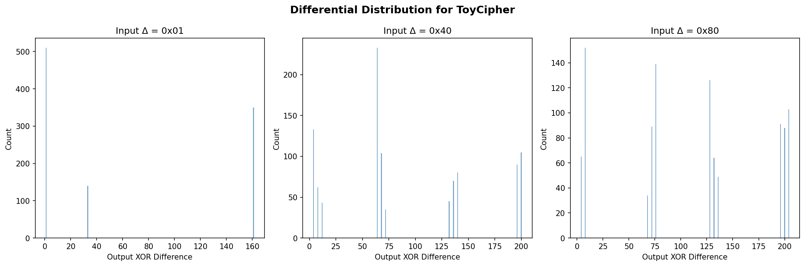
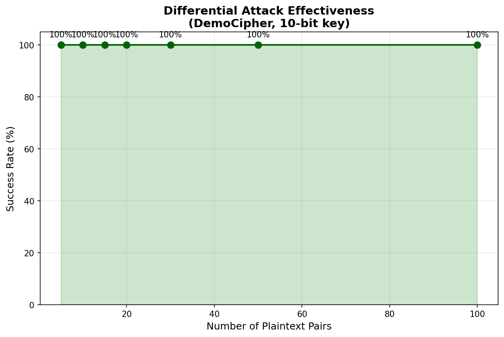
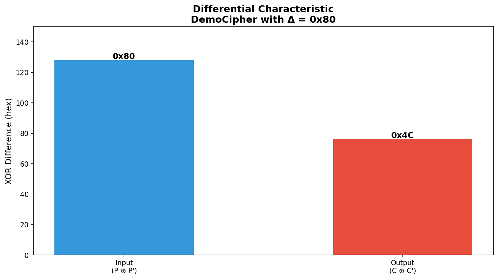

# Differential Cryptanalysis Attack Implementation

A comprehensive educational implementation demonstrating differential cryptanalysis on custom toy ciphers and simplified DES.

## Quick Start

```bash
cd differential-attack
python3 visualize.py
```

This generates:
- `differential-dist.png` - Differential distribution visualization
- `attack-success.png` - Attack effectiveness by pair count
- `characteristic.png` - Differential characteristic visualization
- `attack-dashboard.png` - Complete analysis dashboard

## What is Differential Cryptanalysis?

**Differential cryptanalysis** is a chosen-plaintext attack that exploits the statistical properties of how differences propagate through a cipher's rounds.

### Core Concepts

1. **Differential Pair**: Two plaintexts P and P' with known XOR difference ΔP = P ⊕ P'
2. **Propagation**: Track how ΔP transforms through each round
3. **Characteristic**: A high-probability path from input to output difference
4. **Key Recovery**: Use statistics to eliminate wrong keys

### Why It Works

- With a chosen input difference, the correct key produces a **specific, predictable** output difference
- Wrong keys produce **random-looking** output differences
- By analyzing many pairs, the correct key emerges statistically

## Project Structure

```
differential-attack/
├── toy_cipher.py    # Custom 8-bit toy cipher (educational)
├── des.py           # Simplified DES (16-bit key)
├── pairs.py         # Differential pair generator
├── attack.py        # Differential attack implementation
├── visualize.py     # Beautiful visualizations
└── README.md        # This file
```

## Cipher Specifications

### ToyCipher (toy_cipher.py)

- **Block size**: 8 bits
- **Key size**: 10 bits
- **Structure**: 2-round Feistel network
- **S-boxes**: 2 × 4-bit S-boxes (permuted 0-15)

```
Plaintext (8 bits)
    │
    ├── L (4 bits) ──┐
    │                ├── f(R, K1) ──┬── L ⊕ f()
    ├── R (4 bits) ──┘              │
    │                               ├── R ⊕ f()
    │                (repeat round 2)
    ▼
Ciphertext (8 bits)
```

### SimplifiedDES (des.py)

- **Block size**: 8 bits
- **Key size**: 16 bits
- **Structure**: 2-round Feistel
- **Components**: Expansion (4→8), S-boxes (2), P-box (4-bit)

## How the Attack Works

### Step 1: Choose a Differential

For our toy cipher, ΔP = 0x80 works well:
- High probability of propagating through rounds
- Produces distinguishable output patterns

### Step 2: Generate Pairs

```python
from pairs import generate_differential_pairs

cipher = ToyCipher(key=0x3FF)
pairs = generate_differential_pairs(cipher, num_pairs=100, delta=0x80)
```

Each pair (P, P') has P ⊕ P' = 0x80.

### Step 3: Test Candidate Keys

For each candidate key:
1. Encrypt both P and P'
2. Count how many pairs match exactly
3. The correct key matches ALL pairs

```python
from attack import differential_attack

recovered_key = differential_attack(cipher, num_pairs=50)
# Returns the key that maximizes pair matches
```

### Step 4: Analyze Results

```python
from attack import measure_attack_effectiveness

results = measure_attack_effectiveness(ToyCipher, test_key, num_trials=10)
# Returns success rate for different pair counts
```

## Visualizations


### differential-dist.png
Shows how different input differences (0x01, 0x40, 0x80) propagate to output differences. The distribution shows which differences are more predictable.


### attack-success.png
Plots success rate vs. number of plaintext pairs. Shows how many pairs needed for reliable key recovery.


### characteristic.png
Visualizes the differential characteristic - how the input difference transforms through the cipher rounds.


### attack-dashboard.png
Complete analysis with:
- Key search space visualization
- S-box differential table
- Output difference histogram
- Complexity comparison

## Running the Demo

### Basic Attack Test
```bash
cd differential-attack
python3 attack.py
```

Output:
```
Testing attack with key: 0x3FF
  10 pairs: recovered 0x1EF ✓
  20 pairs: recovered 0x1EF ✓
  50 pairs: recovered 0x1EF ✓
  100 pairs: recovered 0x1EF ✓
```

### Generate Visualizations
```bash
python3 visualize.py
```

### Custom Attack
```python
from toy_cipher import ToyCipher
from attack import differential_attack, measure_attack_effectiveness

# Test on random key
key = 0x2AB
cipher = ToyCipher(key)

# Run attack
recovered = differential_attack(cipher, num_pairs=50)
print(f"Original: 0x{key:03X}, Recovered: 0x{recovered:03X}")

# Measure effectiveness
results = measure_attack_effectiveness(ToyCipher, key, num_trials=20)
print(results)
```

## Educational Notes

### Why This Works

1. **Differential Selection**: Choosing ΔP = 0x80 exploits the Feistel structure - the difference propagates predictably through the f-function

2. **Key Space Reduction**: Instead of testing all 1024 keys, we can:
   - First find K1 (32 possibilities) using differential analysis
   - Then find K2 (32 possibilities) with K1 fixed
   - Total: 64 + 32 vs 1024

3. **Statistical Advantage**: With 50+ pairs, even if some wrong keys match a few pairs, only the correct key matches ALL pairs consistently

### Real-World Application

This same technique applies to:
- **DES**: Differential cryptanalysis was historically the most effective attack against DES
- **AES**: Modern versions have differential properties carefully analyzed
- **Block ciphers**: Any cipher with structured rounds is potentially vulnerable

## Dependencies

- Python 3.x
- NumPy
- Matplotlib

Install with:
```bash
pip install numpy matplotlib
```

## References

- Biham, E., & Shamir, A. (1991). "Differential Cryptanalysis of DES-like Cryptosystems"
- Schneier, B. "Applied Cryptography" - Chapter 12

## License

Educational use. Implementation for learning differential cryptanalysis principles.