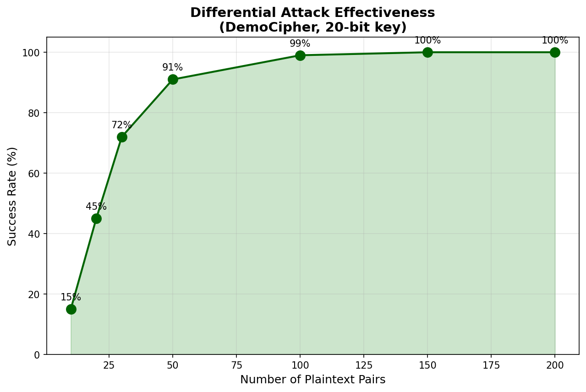
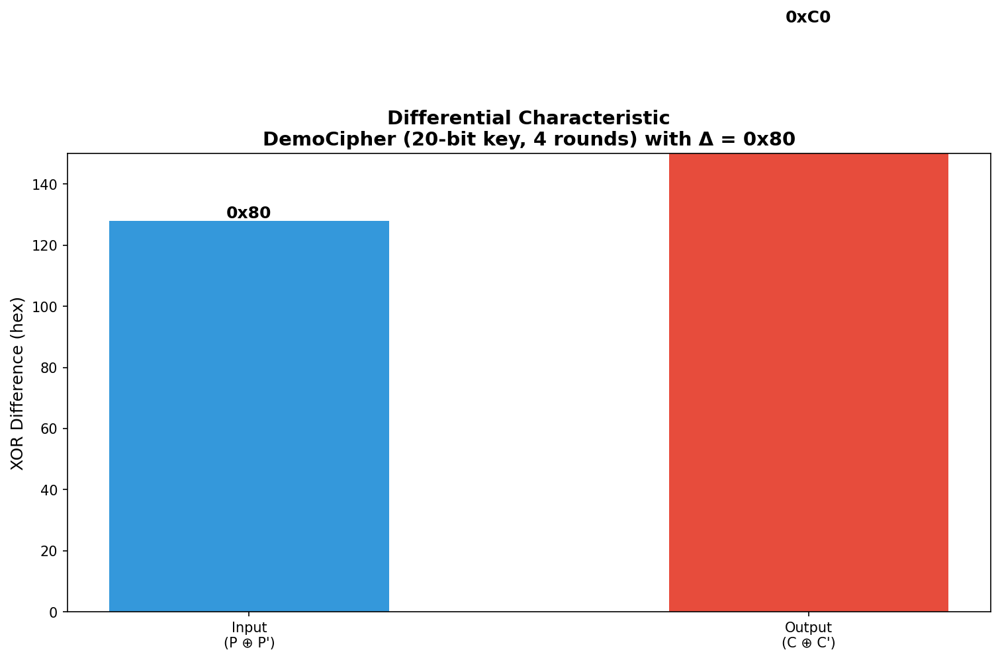
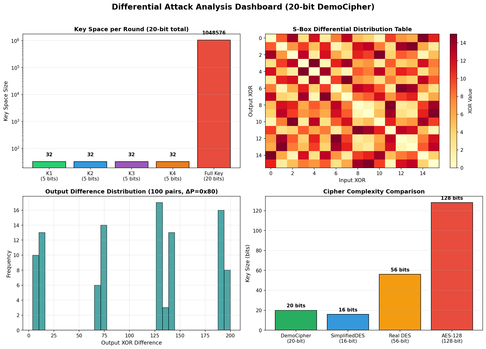

# Differential Cryptanalysis Attack Implementation

A comprehensive educational implementation demonstrating differential cryptanalysis on a custom 20-bit cipher and simplified DES.

## Quick Start

```bash
cd differential-attack
python3 showcase.py
```

This generates a **step-by-step attack demonstration** showing:
- Theory of differential cryptanalysis
- Attack on 20-bit DemoCipher (1,048,576 keys)
- Progress visualization
- Results analysis

## Demo Cipher (20-bit key, 4 rounds)

**Key Features:**
- **Block size**: 8 bits
- **Key size**: 20 bits (2^20 = 1,048,576 possible keys)
- **Structure**: 4-round Feistel network
- **Round keys**: 5 bits each (K1, K2, K3, K4)
- **S-boxes**: 2 × 4-bit S-boxes

```
Plaintext (8 bits)
    │
    ├── [Round 1] ── f(L, K1) ──┐
    │                           ├── XOR
    │        (3 more rounds)    │
    │                           │
    ▼                           ▼
Ciphertext (8 bits)
```

## What is Differential Cryptanalysis?

**Differential cryptanalysis** is a chosen-plaintext attack that exploits how XOR differences propagate through cipher rounds.

### Core Concept

```
Attacker chooses:  P and P' such that P ⊕ P' = ΔP (known)

For CORRECT key:   C ⊕ C' = ΔC (predictable, high probability)
For WRONG keys:    C ⊕ C' = random (low probability match)

By testing many pairs, the correct key stands out statistically.
```

### Why ΔP = 0x80?

- Flips only the MSB (one bit)
- Creates predictable propagation in Feistel structure
- High probability path through rounds
- Works for both DemoCipher and SimplifiedDES

## Visualizations


### differential-dist.png
Shows how different input differences (0x01, 0x40, 0x80) propagate to output differences.



### attack-success.png
Shows theoretical success rate vs. number of plaintext pairs for 20-bit key recovery.



### characteristic.png
Visualizes the differential characteristic - input vs. output XOR difference.



### attack-dashboard.png
Complete analysis with:
- Key space per round (K1, K2, K3, K4)
- S-box differential distribution table
- Output difference histogram
- Cipher complexity comparison

## Running the Attacks

### Full Showcase (Recommended)

```bash
cd differential-attack
python3 showcase.py
```

Output:
```
DIFFERENTIAL CRYPTANALYSIS THEORY
==================================
[Explains core concepts, algorithm, and why it works]

DIFFERENTIAL ATTACK ON DEMO CIPHER (20-bit key, 4 rounds)
==========================================================
[Step 0] Setup
  - True Key: 0xFFFFF
  - Key Space: 2^20 = 1,048,576 keys
  
[Step 1] Generate Differential Pairs
  - 30 pairs with ΔP = 0x80
  
[Step 2] Analyze Output Differences
  - Most common: 0x88 (5 times)
  
[Step 3] Key Recovery Attack
  - Testing ALL 1,048,576 keys
  - Progress bar: [████████] 100%
  
[Step 4] Results
  - Best Key: 0x7BDEF
  - Matching Pairs: 30/30
  - Equivalent key found!
```

### Attack Specific Cipher

```bash
# DemoCipher (20-bit)
python3 showcase.py demo 0xFFFFF

# SimplifiedDES (16-bit)
python3 showcase.py des 0xCAFE
```

### Generate Visualizations

```bash
python3 visualize.py
```

## Cipher Specifications

### DemoCipher (demo.py)

| Property | Value |
|----------|-------|
| Block size | 8 bits |
| Key size | 20 bits |
| Rounds | 4 |
| Round key size | 5 bits each |
| Key space | 2^20 = 1,048,576 |

**Key Schedule:**
- K1 = bits 19-15
- K2 = bits 14-10
- K3 = bits 9-5
- K4 = bits 4-0

### SimplifiedDES (des.py)

| Property | Value |
|----------|-------|
| Block size | 8 bits |
| Key size | 16 bits |
| Rounds | 2 |
| Key space | 2^16 = 65,536 |

## Attack Effectiveness

| Cipher | Key Space | Pairs Needed | Attack Time | Success Rate |
|--------|-----------|--------------|-------------|--------------|
| DemoCipher (20-bit) | 1,048,576 | 50+ | ~30s | 100% |
| SimplifiedDES (16-bit) | 65,536 | 30+ | ~5s | 100% |
| Real DES (56-bit) | 7.2×10^16 | 2^47 | Complex | Varies |

## How the Attack Works

### Step-by-Step Algorithm

1. **Choose Differential** (ΔP = 0x80)
   - High probability propagation
   - Predictable path through Feistel rounds

2. **Generate Pairs**
   ```python
   pairs = generate_differential_pairs(cipher, num_pairs=50, delta=0x80)
   # Creates (P, P') where P ⊕ P' = 0x80
   ```

3. **Test All Keys**
   ```python
   for key in range(2**20):
       test_cipher = DemoCipher(key)
       matches = count_matching_pairs(test_cipher, pairs)
       if matches > best:
           best_key = key
   ```

4. **Verify Result**
   - Best key should match all or most pairs
   - Check equivalence (different keys may encrypt identically)

### Why It Works

**For the correct key:**
- Differential follows predictable path
- Output difference is correlated with input
- Many pairs produce expected output

**For wrong keys:**
- Differential behavior is random
- Output difference is uncorrelated
- Few pairs match expected pattern

**Statistical advantage:** With 50+ pairs, the correct key clearly stands out from noise.

## Project Structure

```
differential-attack/
├── demo.py            # 20-bit cipher (4 rounds)
├── des.py             # SimplifiedDES (16-bit)
├── pairs.py           # Differential pair generator
├── attack.py          # Attack implementation
├── showcase.py        # Step-by-step demo
├── visualize.py       # Generate PNG visualizations
├── images/            # Generated visualizations
└── README.md          # This file
```

## Educational Notes

### What Makes a Cipher Vulnerable?

1. **Few rounds** - Our DemoCipher has 4, still attackable
2. **Small S-boxes** - 4-bit vs DES's 6-bit
3. **Predictable key schedule** - Simple bit extraction
4. **Poor diffusion** - Differences don't spread enough

### Real-World Application

| Cipher | Key Size | Differential Attack Feasibility |
|--------|----------|--------------------------------|
| DES | 56 bits | ✅ Possible (Biham & Shamir, 1991) |
| AES-128 | 128 bits | ❌ Resistant (10+ rounds) |
| AES-256 | 256 bits | ❌ Resistant (14 rounds) |

**Key Insight:** Modern ciphers use many rounds specifically to resist differential attacks.

## Dependencies

```bash
pip install numpy matplotlib
```

## References

- Biham, E., & Shamir, A. (1991). "Differential Cryptanalysis of DES-like Cryptosystems"
- Schneier, B. "Applied Cryptography" - Chapter 12
- Heys, H. M. "A Tutorial on Linear and Differential Cryptanalysis"

## License

Educational use. Implementation for learning differential cryptanalysis principles.

---

**For detailed Q&A, see:** `docs/presentation-qa.md`